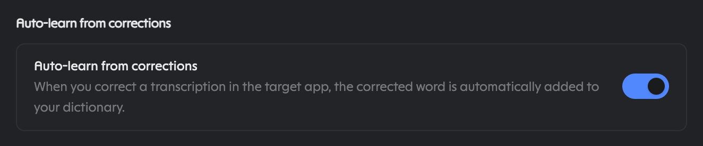

# hermes-openwhispr

A small, local-first plugin between Hermes and OpenWhispr. Offered as a
standalone plugin — not a claim on Hermes core, just an option for people
who want it.

Two doors, pick yours. **You dictate and want your words found:** install
OpenWhispr, leave it running, and an agent can see your dictations —
the rest of this file is the maintainer's case, and the pictures tell it
faster than the prose. **You maintain Hermes and you're reviewing a
proposal:** keep reading; every claim is followed by its evidence, and the
trust material (privacy, disclosures, attribution) sits after the story.

Words used once, for everyone: STT means speech-to-text (voice into
words). MCP means Model Context Protocol (how assistants read app data).
A gateway is any Hermes front door — Discord, Telegram, the terminal, and
friends. CLI, TUI, dashboard, and desktop are the four local faces:
command line, terminal UI, web panel, native app.

## What it does

- Reads your OpenWhispr dictation history (transcriptions) so an agent can
  find what you said, even when you can't remember it.
- Reads, searches, and (with your say-so) writes OpenWhispr notes as a
  handoff surface between agents.
- Transcribes local audio with your desktop model, optionally filing it
  straight to a note.
- Manages dictionary words and snippets from the terminal.

What it doesn't do: replace Hermes STT, include assistant replies, or
touch the cloud unless you explicitly opt in.

## Why this sells itself (not our product, just the facts)

Per-feature model choice across tiers — Dictation Cleanup, Voice
Assistant, Translation, Note Formatting, Chat each pick independently
from: OpenWhispr Cloud (no setup), Cloud Providers (bring your own key),
Local (on-device, fully private), Self-Hosted (your server on your
network), Enterprise (your org's cloud account — AWS and Azure real,
GCP marked planned in their docs). A live transcription preview can show
in a floating window before cleanup (see the dictation shot below).

Auto-learn from corrections is off by default; once you enable it under
Settings → Preferences, the words you fix in the target app land in your
dictionary by themselves. "Automatic pasting" drops text into the active
app, "Keep transcription in clipboard" holds it for manual pasting.
Optional file export saves notes and transcripts to disk organized by
folder, with "Rebuild all files" — a second on-disk breadcrumb trail
agents can read directly. Calendar integrations are all optional; only
Google's row promises auto-filled titles and attendees, Microsoft and
Apple say "read," and Apple reads Calendar.app. CLI and MCP split
cleanly: local CLI free with no key, cloud CLI and assistant connectors
(a paid tier, buttons as labeled in the app's Integrations screen).

Under the hood it's bundled C++ runtimes, not a Python stack:
whisper.cpp for the Whisper family, sherpa-onnx for Orukeet, Parakeet,
Nemotron, and Cohere — no interpreter or runtime to install. Metal
acceleration is built in on Apple Silicon with automatic CPU fallback,
CUDA/Vulkan are one-click on other platforms, and the default local
model is ~672MB with the most accurate offline option at ~2.7GB. Small
binaries, honest sizes, GPU when it's there, CPU when it isn't.

- **One trail across every surface.** Discord, every gateway, every
  interface — CLI, TUI, dashboard, desktop. Because OpenWhispr sits at
  voice input rather than inside any one app, it's a rolling record of
  everything you say across all of those trajectories, not just one
  chat log. Wherever the words came out, the breadcrumb is there.
- **Scale it to your machine and your appetite, not five fixed sizes.**
  Small computer with thin resources, or light needs? Go small. Want a
  secretary in the chat interface minting notes alongside Hermes into a
  shareable location? Go big. Sharing anything is opt-in; staying
  private is a switch — turn everything off and it all still works
  on-device. All up to you.

## Screenshots

Read top to bottom — each picture follows the claim it proves, with its
context right beside it so nothing needs backtracing. Personal details
redacted with blur before publishing.

### Integrations screen: assistant upsell on top, CLI access below


The eye hits the paid connector card first; the CLI card underneath is
the free half: `npm install -g @openwhispr/cli`, then
`openwhispr --local transcriptions list --limit 5` with no login.
(`notes list` starts empty — notes are the handoff surface you save to,
transcriptions are the history.)

### Per-feature model picker: five tiers, your call each time


Dictation Cleanup, Voice Assistant, Translation, Note Formatting, Chat —
each picks independently from OpenWhispr Cloud, Cloud Providers (own
key), Local on-device private, Self-Hosted, or Enterprise.

### Auto-learn from corrections (shown after enabling it)



Fix a word in the target app and it joins your dictionary — but only
after you flip this switch on. Nothing learns silently.

### Clipboard flow plus save-notes-as-files (save path redacted)


"Automatic pasting," "Keep transcription in clipboard," and on-disk
Markdown organized by folder with "Rebuild all files" — a second
breadcrumb trail agents can read directly.

### Optional calendars and paywalled API access (account email redacted)


Only Google is connected here, which is the row that auto-fills meeting
titles and attendees. API access itself sits behind the paid plan.

### A different picker: dictation engines, four tiers, four local vendors


Not the same dialog as above: Dictation, Note Recording, Audio Upload
across Cloud, own-key, Local, Self-Hosted — no Enterprise tier here.
Local vendors Oruk, OpenAI, NVIDIA, Cohere, with Cohere Transcribe 2B
active on-device — plus the live-transcription floating preview.

### Dictation Cleanup download list: six vendors, honest sizes


Qwen, Mistral, Meta Llama, OpenAI, Gemma, Liquid AI. These are downloads,
not installs — Gemma 4 31B shows a Download button at 19.6GB, and the
list continues below the crop. Pin a different model per task or run
everything on one — local, cloud, self-hosted, or enterprise, decided
per feature, not per app.

## The point in one paragraph

No Python dependencies and no changes to Hermes itself — though be
honest about the price of admission: Node 20, one global CLI package,
and the desktop app running (plus `ffmpeg` on PATH for large cloud
uploads). What you get is your dictations — not assistant replies —
showing up in every space you interact in, with every agent you talk to.

## A win for both sides — and everyone in between

- **OpenWhispr** meets a crowd of local-first users who would never
  otherwise try it. Free local gets them in; the paid cloud, MCP
  connectors, and API are one step away when they want more — plus an
  agent bootstrap flow that mints scoped keys with a single email code.
- **Hermes and Nous Research** get the option of a local default that
  remembers: every user carrying a rolling record of what they said,
  reachable from any surface, on top of transcription they already trust.
- **Users** stop choosing between a bill and a memory. Start free and
  private; pay only if the cloud earns it; never lose what you said.
  Tie in email, keep notes, transcribe audio — small pieces, and
  together nearly a powerhouse.

## Privacy is yours to tune

Granular, both directions, your call throughout:

- **Local:** free, no login, audio never leaves your machine. Requires the
  OpenWhispr desktop app running (desktop bridge on loopback; the live
  port is recorded in the CLI's bridge file). This is the default and
  works without any key.
- **Cloud:** opt-in only. Needs a Pro or Business plan plus
  `openwhispr auth login` (the key lives in the CLI's own config, not in
  Hermes `.env`). Cloud transcription is beta with no SLA; files over 4 MB
  are chunked client-side and need `ffmpeg` on PATH.
- **Reads vs writes:** reads and searches are always safe. Creates, updates,
  and deletes (notes, transcriptions, dictionary, audio) only happen with
  your explicit consent, every time.
- **Dictionary:** a hint to the model, not an override. Auto-learn from
  corrections (Settings → Preferences) is off unless you turn it on.
  Export it before moving machines.

## Disclosures (catalog review)

- Shell-outs to `openwhispr *` through the `terminal` tool only.
- Local network: loopback desktop bridge when using `--local`. The app
  writes a one-time bearer token to its own bridge file (mode `0600`) at
  startup and the CLI reads it automatically — loopback is authenticated,
  not open.
- Remote network: api.openwhispr.com only when you opt into `--remote`.
- The agent never opens credential files itself: the vendor CLI reads its
  own bridge token and `~/.openwhispr/cli-config.json` (both `0600`).
  Key setup includes the agent bootstrap flow (`/auth/email-code`, a
  6-digit code the user pastes, `POST /keys/create` for a scoped key) —
  always with consent, key stays in the CLI config, never in Hermes
  `.env`. Note `transcriptions:delete` has no desktop-app checkbox, so a
  delete-capable key can only be born through the API.
- No daemons of ours, no self-updater, no telemetry. (The desktop app
  itself must be running for local mode — that's theirs, not ours.)
- No core overrides: no patching of Hermes functions, modules, or stores.
  If a needed hook doesn't exist, that's an upstream feature request.

## Attribution

- **OpenWhispr** makes the dictation app, the CLI (`@openwhispr/cli`),
  the cloud API, and the docs at docs.openwhispr.com this plugin leans
  on. All screenshots are of their application; all product names and
  marks are theirs. This plugin is an independent community pitch, and
  OpenWhispr should know it's being recommended to Nous Research as an
  option — with appreciation, and without claiming their endorsement.
- **Hermes Agent by Nous Research** is the platform this plugin extends,
  through public plugin surfaces only. This is a proposal for their
  consideration, not a directive — adoption as a first-class option is
  theirs to decide.
- This plugin itself is community work, published under MIT, with no
  affiliation to either party.

## Layout

```
hermes-openwhispr/
├── plugin.yaml
├── __init__.py                      # register_skill(), skill-carrier
├── README.md
├── LICENSE
├── skills/openwhispr/SKILL.md
├── docs/screenshots/01-07*.png
└── tests/test_plugin.py
```

## Install

Command line all the way down — no App Store involved:

```bash
brew install --cask openwhispr     # desktop app (verified in the brew catalog)
npm install -g @openwhispr/cli     # agent CLI (pnpm or bun work too)
```

Alternatives straight from the source: openwhispr.com/download for the
signed builds (macOS, Windows, Linux, iOS), GitHub releases for the
`.dmg` files (Apple Silicon and Intel), or `git clone
https://github.com/OpenWhispr/openwhispr.git` plus `npm install` /
`npm run dev` if you build from source. OpenWhispr itself is MIT-licensed
open source. Leave the app running — the local bridge is what the agent
talks to.

## Smoke test

```bash
npm install -g @openwhispr/cli
openwhispr doctor                      # exit 0, local bridge reachable
openwhispr --local transcriptions list --limit 5
hermes plugins install <repo-url> && hermes plugins enable hermes-openwhispr
# then in a session: skill_view("hermes-openwhispr:openwhispr")
# (plugin skills load by qualified name; they are not auto-indexed)
python -m pytest tests/ -q             # here
```

The Hermes-side skill test (`tests/skills/test_openwhispr_skill.py`)
belongs to a hermes-agent PR, once proposed — not to this repo.

## Proposal path

Pitched as a standalone plugin. Hermes's own guide keeps third-party
product integrations in standalone repos rather than the core tree, so
any ship-bundle conversation would be a separate, optional ask — no
presumption either way. This stands alone regardless.
