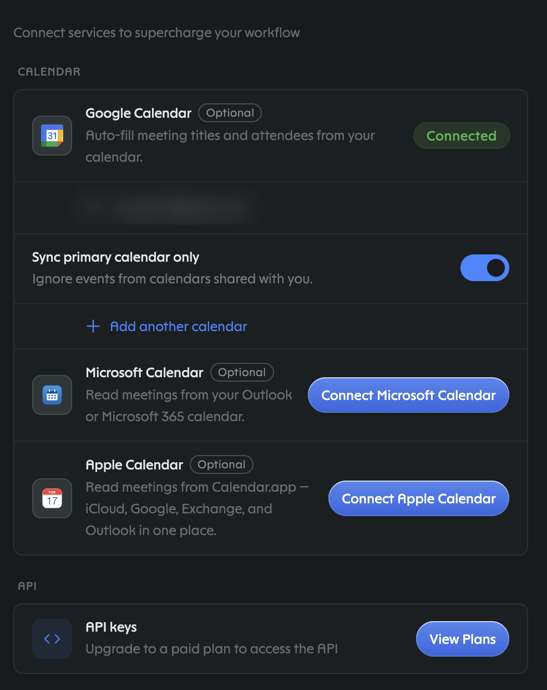
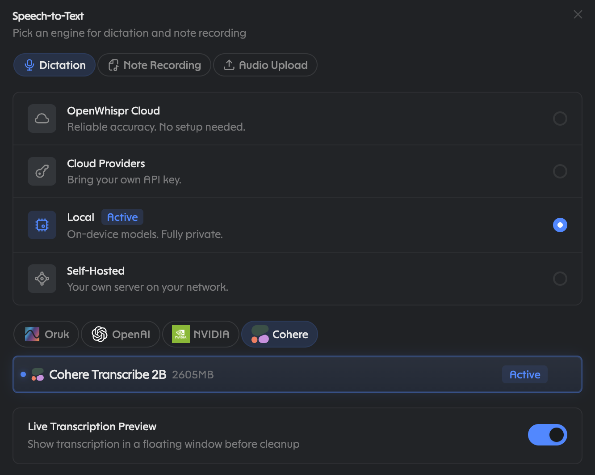
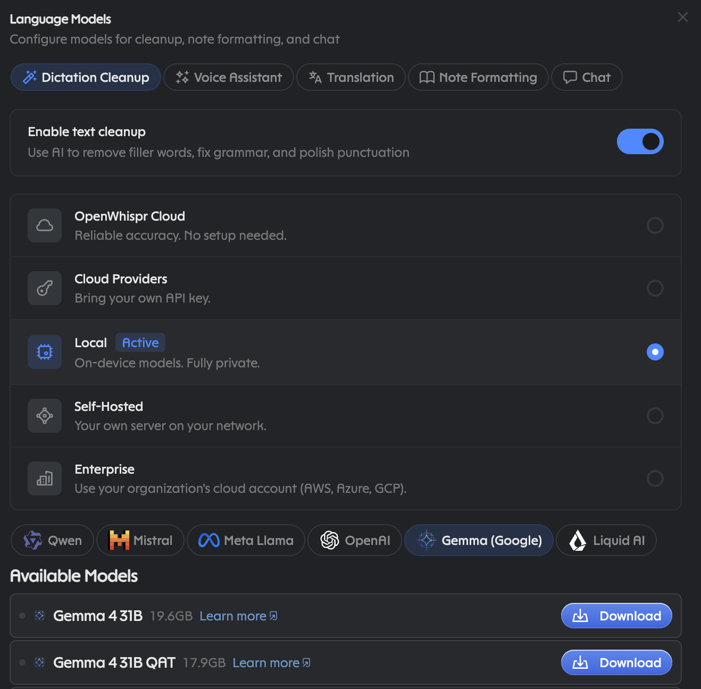
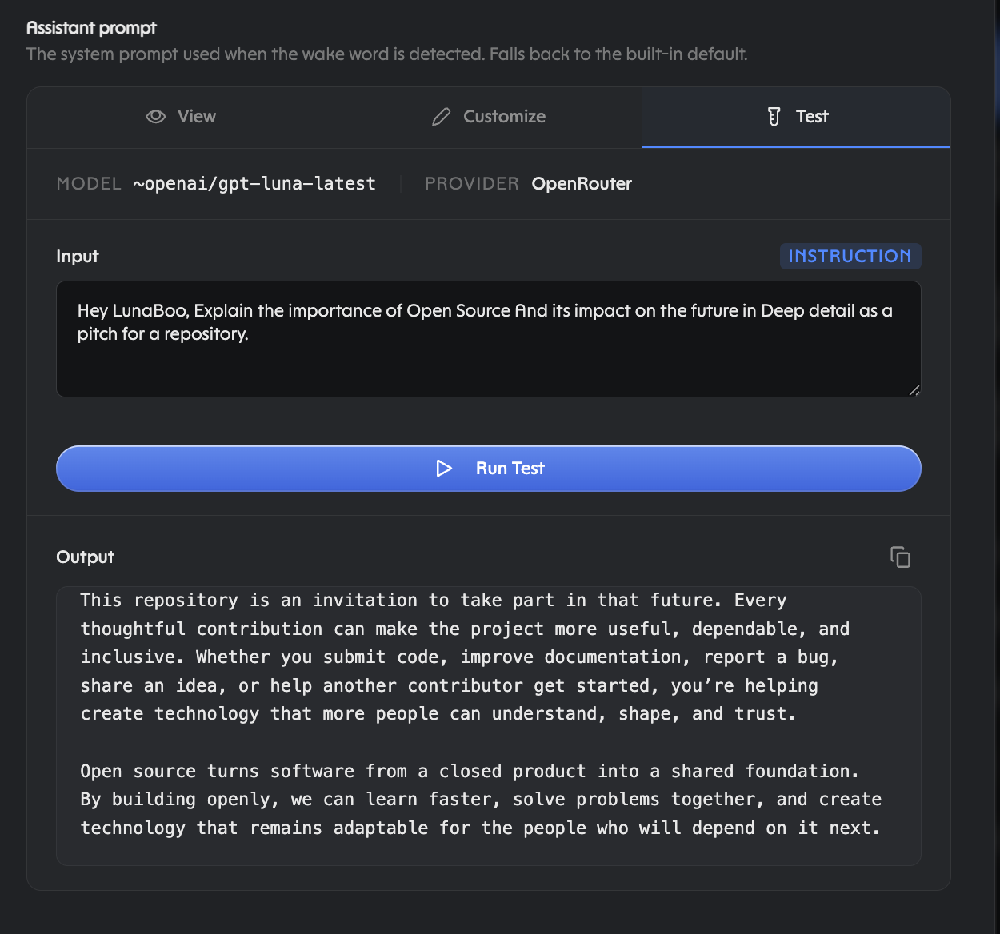

# claude-openwhispr

One skill, no code. It teaches Claude to search what you dictated, read and
write OpenWhispr notes, and transcribe local audio, all through the
`openwhispr` CLI and Bash. Local by default; cloud only if you say so.

**You dictate and want your words found:**

```bash
brew install --cask openwhispr     # or openwhispr.com/download
# open the app, press your dictation hotkey, say something
npm install -g @openwhispr/cli
openwhispr doctor                  # local bridge reachable
```

Then add the plugin inside Claude Code:

```
/plugin marketplace add <owner>/claude-openwhispr
/plugin install openwhispr@openwhispr
```

One worked session, the whole product:

> You: "find what I just dictated about the dentist"
> Claude: `openwhispr --local notes search "dentist" --limit 20`
> → note id 7, `created_at` this morning → `notes get 7 --transcript`
> → your words, quoted back with id + timestamp.

The skill loads as `/openwhispr:openwhispr` and Claude reaches for it
on its own when you ask about something you said.

## What it does

- Reads your OpenWhispr dictation history so Claude can find what you
  said, even when you can't remember it.
- Reads, searches, and (with your say-so) writes OpenWhispr notes as a
  handoff surface between agents.
- Transcribes local audio with your desktop model, optionally filing it
  straight to a note.
- Manages dictionary words and snippets.

What it doesn't do: include assistant replies, replace whatever voice input
you already use, or touch the cloud unless you explicitly opt in.

## Why OpenWhispr

Because OpenWhispr sits at voice input rather than inside any one app, it is
a rolling record of everything you say, whichever app or agent heard it. The
screenshots below are of their application; read top to bottom.

- **Per-feature model choice.** Dictation Cleanup, Voice Assistant,
  Translation, Note Formatting, Chat each pick independently: OpenWhispr
  Cloud, your own cloud key, Local (private, on-device), Self-Hosted, or
  Enterprise.
- **Nothing learns silently.** Auto-learn from corrections is off until you
  enable it.
- **A second trail on disk.** Optional file export saves notes and
  transcripts as Markdown by folder, which Claude can read directly.
- **Honest runtimes.** whisper.cpp and sherpa-onnx, bundled: no Python stack
  to install, Metal on Apple Silicon, CUDA/Vulkan elsewhere, CPU fallback.

### Integrations: assistant upsell on top, free CLI below


The paid connector card catches the eye first; the CLI card underneath is the
free half. Dictations land as notes automatically, so for anything older than
today: `openwhispr --local notes search "<phrase>" --limit 20`, then
`notes get <id> --transcript`.

### Per-feature model picker


### Auto-learn from corrections (shown after enabling it)


### Clipboard flow and save-notes-as-files (save path redacted)


### Optional calendars and paywalled API access (account email redacted)



### Dictation engines: four tiers, four local vendors



### Dictation Cleanup downloads: six vendors, honest sizes



### Same question, two brains: local vs cloud




## Privacy is yours to tune

- **Local:** free, no login, audio never leaves your machine. Needs the
  OpenWhispr desktop app running (loopback bridge; the live port is recorded
  in the CLI's bridge file). The default, and works without any key.
- **Cloud:** opt-in only. Needs a paid plan plus `openwhispr auth login`; the
  key lives in the CLI's own config. Cloud transcription is beta with no SLA;
  files over 4 MB are chunked client-side and need `ffmpeg` on PATH.
- **Reads vs writes:** reads and searches are always safe. Creates, updates,
  and deletes only happen with your explicit consent, every time.
- **Dictionary:** a hint to the model, not an override. Export it before
  moving machines.

## Disclosures

- Shell-outs to `openwhispr *` through the Bash tool only.
- Local network: loopback desktop bridge when using `--local`. The app writes
  a one-time bearer token to its own bridge file (mode `0600`) at startup and
  the CLI reads it automatically, so loopback is authenticated, not open.
- Remote network: api.openwhispr.com only when you opt into `--remote`.
- The agent never opens credential files itself: the vendor CLI reads its own
  bridge token (`~/.openwhispr/cli-bridge.json`) and
  `~/.openwhispr/cli-config.json` (both `0600`). Key setup includes the agent
  bootstrap flow (`/auth/email-code`, a 6-digit code the user pastes,
  `POST /keys/create` for a scoped key), always with consent.
- No hooks, no MCP servers, no executable code, no self-updater, no
  telemetry. The plugin is a manifest and a Markdown file.

## Attribution

- **OpenWhispr** makes the dictation app, the CLI (`@openwhispr/cli`), the
  cloud API, and the docs at docs.openwhispr.com this plugin leans on. All
  screenshots are of their application; all product names and marks are
  theirs.
- **Claude and Claude Code** are Anthropic's. This is independent community
  work, published under MIT, affiliated with neither party and claiming no
  endorsement from either.

## Layout

```
claude-openwhispr/
├── .claude-plugin/
│   ├── plugin.json
│   └── marketplace.json
├── skills/openwhispr/SKILL.md
├── docs/screenshots/
├── tests/test_plugin.py
├── README.md
├── CONTRIBUTING.md
└── LICENSE
```

## Smoke test

```bash
openwhispr doctor                      # exit 0, local bridge reachable
openwhispr --local notes search "hello" --limit 5
python -m pytest tests/ -q
```

Then, in Claude Code: ask "what did I dictate about the dentist?" and watch
it run the search.
